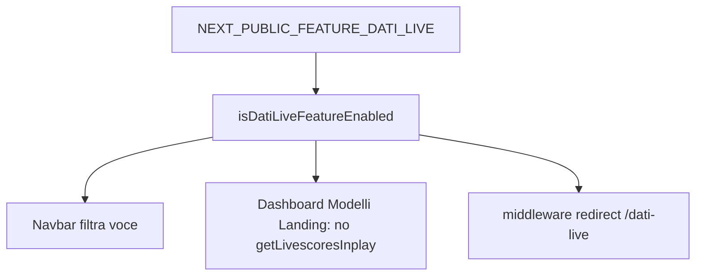

# Piano: punto 1 roadmap — nascondere «Dati Live» (feature flag)

## Obiettivo (da [`.cursor/plans/top_football_data_roadmap_325cad79.plan.md`](.cursor/plans/top_football_data_roadmap_325cad79.plan.md) §1)

- Nessuna voce menu / link evidente verso Dati Live quando la funzione è spenta.
- Nessuna chiamata runtime a `getLivescoresInplay()` (quindi niente hit a `GET /api/football/livescores/inplay`) su pagine che oggi la usano «in background».
- Route [`/dati-live`](src/app/(app)/dati-live/page.jsx) e schermo [`DatiLive.jsx`](src/screens/DatiLive.jsx) restano nel repo; accesso diretto URL reindirizzato quando il flag è off.
- Documentazione env per riaccendere tutto in un solo posto.

## Perché questo approccio (e cosa evitare)

**Sì, è il modo giusto** se l’obiettivo è: niente consumo API / niente superficie prodotto oggi, ma **stesso codice** pronto per domani.

- **Mantieni route + schermo + API route**: nulla va cancellato dal repo; la funzione esiste ancora e resta testabile in locale impostando il flag a `true`.
- **Un solo “interruttore”** (`NEXT_PUBLIC_FEATURE_DATI_LIVE`): riattivazione = env + (su Vercel spesso) **nuovo deploy** — vedi nota sotto.
- **Meglio di**: commentare blocchi a mano (si rompono al merge), tenere tutto solo su un branch lungo (drift e conflitti), o rimuovere il codice e ripescarlo da git (più lento e rischioso).

**Alternativa più pesante** (solo se servisse cambiare il flag **senza** rebuild): esporre un flag runtime da API/Edge e far leggere Navbar al client — utile per A/B operativi, ma aggiunge complessità; per “accendi/spegni Dati Live” il flag `NEXT_PUBLIC_*` è sufficiente.

**Nota operativa Next.js / Vercel:** le variabili `NEXT_PUBLIC_*` sono **iniettate al build**. Cambiare solo la variabile in dashboard Vercel **non** aggiorna il bundle già deployato finché non fai un **redeploy** (o build da zero). Per le riattivazioni future: documentare «imposta env + redeploy» oppure accettare che in dev basti `.env.local` + restart dev server.

## Convenzione flag

- Nome: `NEXT_PUBLIC_FEATURE_DATI_LIVE` (come nella roadmap; prefisso `NEXT_PUBLIC_` così è leggibile anche da client components).
- Semantica consigliata: **abilitato solo se** valore è esattamente `"true"` (stringa). Default: assente / altro → **disabilitato** (comportamento sicuro in produzione).
- Aggiungere riga in [`README.md`](README.md) nella sezione configurazione (e opzionalmente nota in [`TODO_SVILUPPO_TOP_FOOTBALL_DATA.txt`](TODO_SVILUPPO_TOP_FOOTBALL_DATA.txt) sotto «riattivazione»).

## Implementazione tecnica

### 1. Helper centralizzato

- Nuovo file piccolo, es. [`src/lib/feature-flags.js`](src/lib/feature-flags.js), con una funzione `isDatiLiveFeatureEnabled()` che legge `process.env.NEXT_PUBLIC_FEATURE_DATI_LIVE === "true"`.
- Tutti i punti sotto importano solo questo helper (evita stringhe duplicate).

### 2. Navbar

- In [`src/components/layout/Navbar.jsx`](src/components/layout/Navbar.jsx), filtrare `NAV_ITEMS` (o equivalente) così la voce `{ label: "Dati Live", path: "/dati-live", ... }` **non viene renderizzata** quando il flag è off.

### 3. Ridurre / eliminare fetch livescore

| File | Comportamento quando flag off |
|------|-------------------------------|
| [`src/screens/Dashboard.jsx`](src/screens/Dashboard.jsx) | Non includere `getLivescoresInplay()` nel `Promise.all`; impostare `livePayload` a `null` (o payload vuoto) senza chiamare l’API. Aggiornare memo/derivati (`liveCount`, ecc.) di conseguenza. |
| [`src/screens/ModelliPredittivi.jsx`](src/screens/ModelliPredittivi.jsx) | Stesso: solo `getScheduleWindow` se off; `liveMatch` / widget live null. |
| [`src/screens/Landing.jsx`](src/screens/Landing.jsx) | Stesso nel `useEffect` che carica metriche: niente `getLivescoresInplay()`; metriche live a 0 o derivate solo dallo schedule se serve coerenza UX. |

[`src/screens/DatiLive.jsx`](src/screens/DatiLive.jsx): non viene montata se l’utente non arriva alla route (redirect); se si preferisce difesa in profondità, si può evitare il fetch anche lì quando il flag è off (redondante con redirect).

### 4. Link e CTA verso `/dati-live`

- **Dashboard** ([`Dashboard.jsx`](src/screens/Dashboard.jsx)): la card statistiche «Partite Live» (icona Zap, `path: "/dati-live"`, righe ~182–187) va **omessa** o sostituita con un blocco che non punti a Dati Live quando il flag è off (es. array di stat filtrato, griglia `md:grid-cols-3` se restano 3 card).
- Cercare altri `to="/dati-live"` nello stesso file (~434) e condizionarli o rimuoverli.

- **Landing**: il pillar «Dati Live» in `PILLARS` ([`Landing.jsx`](src/screens/Landing.jsx) ~24–28) va filtrato quando il flag è off, così non resta marketing verso una funzione spenta.

### 5. Redirect `/dati-live` con flag off

- Il repo **non ha** [`middleware`](middleware) oggi; conviene aggiungere [`src/middleware.js`](src/middleware.js) (o `.ts` se preferite) che, per path esattamente `/dati-live`, se `!isDatiLiveFeatureEnabled()`, esegue `NextResponse.redirect(new URL("/dashboard", request.url))` (o `/` se preferite — allineare alla roadmap che suggeriva dashboard o soft 404).
- Alternativa senza middleware: pagina server wrapper che chiama `redirect()` — meno uniforme per «accesso diretto». Il middleware copre anche refresh e link esterni.

### 6. Verifica

- Con flag assente o `false`: nessuna richiesta a `/api/football/livescores/inplay` aprendo Dashboard, Modelli, Landing (Network tab o log).
- Con `NEXT_PUBLIC_FEATURE_DATI_LIVE=true` in `.env.local`: comportamento attuale ripristinato (nav + fetch + pagina Dati Live).

## Note

- Non serve cambiare [`src/app/api/football/livescores/inplay/route.js`](src/app/api/football/livescores/inplay/route.js): l’obiettivo è **non invocarla** dal client quando il prodotto è «spento».
- Dopo l’implementazione, aggiornare il todo `flag-live` nella roadmap YAML se usate i todo integrati, oppure segnare manualmente come completato.
