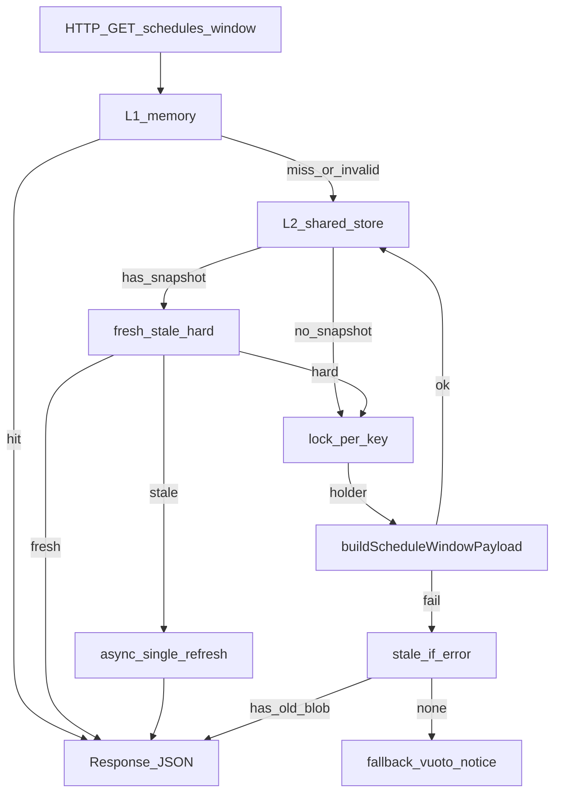

# Feed 7 giorni «velocissimo» — piano definitivo (pre-implementazione)

**Stato del documento:** solo planning; nessun codice, nessun refactor UI, nessuna modifica ai contratti API del schedule in questa fase.

**Direzione approvata:** shared cache persistente + SWR lato service + prewarm leggero, con i guardrail sotto vincolanti.

**Feed in scope:** unico `days=7`, allowlist campionati già chiusa e corretta; stesso body atteso rispetto a oggi per dashboard e modelli predittivi.

**Riferimenti codice (baseline attuale):**

- Client: [src/api/football.js](src/api/football.js) — coalescing inflight su stessa URL.
- Server: [src/server/football/service.js](src/server/football/service.js) — `getScheduleWindowPayload`, L1, inflight, stale-if-error in-memory.
- Route: [src/app/api/football/schedules/window/route.js](src/app/api/football/schedules/window/route.js)
- Provider: [src/lib/providers/sportmonks/index.js](src/lib/providers/sportmonks/index.js)
- Policy leghe: [src/lib/sportmonks-priority-league-ids.js](src/lib/sportmonks-priority-league-ids.js)

---

## Analisi dello stato attuale (reale)

### Livelli di cache oggi

| Livello | Comportamento |
|--------|----------------|
| **Client** ([src/api/football.js](src/api/football.js)) | **Coalescing inflight:** due richieste concorrenti alla stessa URL condividono la stessa `Promise` finché la prima non completa. **Non** c’è cache persistente lato browser sul payload: dopo la `Promise` completata, ogni nuova richiesta (nuovo mount, tab, F5) riparte da zero se il server non risponde subito per altro motivo. |
| **Server** (route + `getScheduleWindowPayload`) | **Memory cache in-process** (`Map` su `globalThis`), chiave legata a `days` (es. 7), TTL finito (ordine di ~60s nel design attuale). **Coalescing inflight** per la stessa chiave: richieste parallele mentre c’è un fetch in corso attendono la stessa risposta (coerente con telemetria tipo `inflight_shared`). Dopo scadenza TTL o **restart** (deploy, cold start Vercel, scale, altra istanza), la cache è vuota → di nuovo cold path. |
| **Provider Sportmonks** | Nessuna cache «durable»: ogni miss server-side implica HTTP verso `fixtures/between` con paginazione (costo dominante in latenza e payload grezzo), più normalizzazione a valle. |

### Perché oggi è veloce solo con memory «calda»

- Primo utente/istanza dopo cold o dopo TTL paga: provider + normalizzazione + costruzione payload JSON.
- Richieste successive **entro TTL** sulla stessa istanza leggono la `Map`: pochi ms, payload pronto.
- Inflight **riduce doppie chiamate concorrenti**, non elimina i cold fetch tra sessioni, deploy o idle oltre TTL.

### Perché dopo un po’ / nuova sessione / cambio pagina torna al cold fetch

- TTL breve → i dati scadono spesso.
- Istanze multiple o serverless → due richieste possono colpire worker diversi senza `Map` condivisa.
- Cambio pagina o refresh = nuova richiesta HTTP: se nessun worker ha cache, di nuovo cold.
- Coalescing client aiuta **solo** se due componenti chiamano **contemporaneamente**; non a distanza di tempo.

### Ordine tipico del costo (questo feed)

1. **Provider fetch** (rete, paginazione, volume dati) — spesso la fetta più grossa in secondi su cold.
2. **Normalizzazione** su molti match — CPU + `JSON.stringify` per telemetria/serializzazione.
3. **Route/service** — overhead minimo rispetto ai due sopra, salvo risposta molto grande.
4. **Lifecycle cache** — spiega varianza 20–30s vs 10ms, non la «correttezza» del dato.

### Strategia nello stack attuale (ponte verso l’architettura definitiva)

- **L1 quasi obbligatoria in prod:** store condiviso persistente oltre la memory per worker (es. Redis/Upstash, Vercel KV) con chiave stabile o versionata.
- **SWR server-side:** TTL lungo per «served from cache» + task di refresh quando stale.
- **Prewarm** periodico in orari caldi, così l’utente raramente paga il cold.
- **Mongo** come primary del feed: possibile (collection con TTL index, documento JSON); per «veloce e semplice» spesso **KV + blob JSON** batte query aggregate a ogni hit; se Mongo è già in uso, un documento `football_cache` con blob finale è coerente.
- **Allowlist / policy:** la chiave deve includere **versione o hash** dell’allowlist così un cambio non serve snapshot vecchi errati.

### Guardrail obbligatori (sintesi — dettagli nelle sezioni 1–5)

1. **Cache = payload finale normalizzato** (equivalente al body di `/api/football/schedules/window?days=7`), **non** raw Sportmonks né dump provider grezzo.
2. **Chiave versionata:** non solo `days=7` — includere `policyVersion` (allowlist / policy prodotto).
3. **Anti-stampede:** lock + un solo refresh per key; le altre richieste leggono stale o attendono in modo controllato.
4. **Stale-if-error:** se il provider fallisce ma esiste ultimo snapshot utile, servirlo con metadata stale, non strappare l’UX.
5. **Policy TTL a tre livelli:** fresh (servi, zero refresh) → stale (servi + refresh async single-flight) → hard-expired (rebuild; se fallisce, stale-if-error entro `T_error_max`).
6. **Prewarm = stesso builder** del path runtime, due sole modalità d’invocazione (runtime vs cron/prewarm).
7. **Outcome UX:** niente 20–30s in navigazione normale; cambio pagina quasi mai cold lungo; dopo inattività restare reattivi nella maggior parte dei casi (L2 + prewarm).

---

## 1. Architettura definitiva consigliata

**Scelta netta:** un’unica pipeline «build feed schedule» che produce il **payload finale già normalizzato**, identico a ciò che oggi serializza la response JSON di `GET /api/football/schedules/window?days=7`. Quel risultato è l’unico artefatto persistito nello **store condiviso** sotto una **chiave versionata** per policy.

**Componenti:**

| Componente | Ruolo |
|------------|--------|
| **Builder unico** | Chiama il provider (allowlist già in linea con il prodotto) → normalizza → costruisce l’oggetto finale (inclusi campi oggi presenti: `matches`, `window`, `notice`, `rawSchedules` **compatto** se fa parte del contratto, `freshness`, ecc.). |
| **Store persistente (L2)** | Contiene **solo** snapshot finale (niente raw non processato, niente array `fixtures` grezzi di paginazione se non necessari al body). |
| **Lock / inflight condiviso** | Per (days, `policyVersion`): un solo refresh attivo cross-istanza, non solo `globalThis` per worker. |
| **Memory L1 (opzionale, consigliata)** | `Map` in-process come oggi: hit ancora più veloce sulla stessa istanza; **non sufficiente** da sola su Vercel. |
| **Prewarm / cron** | Stesso entrypoint del builder, es. con flag interno `mode: "prewarm"` solo per log/metriche, **stessi input** (7 giorni, stessa policy). |
| **Telemetry** | Log esistenti + campi aggiuntivi: `cacheLayer` (L1 / L2 / provider), `snapshotAgeMs`, `refreshState`, `cacheState` esteso (es. `edge_kv`, coerente con `memory_cache` / `stale_cache`). |

**Percorso read (logico):** richiesta → **L1** (se hit e coerente con policy TTL) → **L2** snapshot → classificazione **fresh / stale / hard-expired** → se serve refresh: **sotto lock e single-flight** → risposta (sempre veloce in lettura quando possibile: stale servito subito, refresh async per stato stale).

**Percorso refresh (logico):** lock acquisibile? → **sì** → builder unico → scrittura atomica snapshot + metadata → rilascio lock. Concorrenti: **Opzione A (consigliata UX)** servono subito lo snapshot **stale** e non lanciano un secondo provider; **Opzione B** attendono su inflight/risultato condiviso (stesso pattern concettuale di oggi, ma con backing distribuito, non solo memoria stesso worker).

---

## 2. Cache model

### Cosa viene salvato (guardrail: payload finale, non raw)

- **Sì:** oggetto pronto per `NextResponse.json` / stesso shape del body attuale per `days=7` (incluso ciò che oggi è intenzionalmente nel contratto, es. `rawSchedules` **compatto** se presente e richiesto dal client).
- **No:** response raw Sportmonks non processata, array di `fixtures` grezzi di provider, dump paginato intero se non coincide con il body servito. Obiettivo: **un solo deserializzare + servire** in hot path.

### Chiave: concezione robusta (non «solo days=7»)

**Pattern concettuale (stringa stabile in implementazione):**

`football:schedule:window:{days}:policy:{policyVersion}`

- `days` = `7` per questa fase (estendibile in seguito senza cambiare l’idea).
- `policyVersion` coerente con allowlist / policy prodotto, es.:
  - **Raccomandato:** hash deterministico della lista di ID allowlist **ordinata** (es. SHA-1/SHA-256 troncata a 8–12 caratteri) → bump automatico a ogni modifica lista senza dimenticare rilasci manuali; opzionale prefisso umano `v3-` + hash per debug.
  - **Alternativa:** versione manuale semantica (`v1`, data release) — più error-prone se non disciplinata.

Esempi concettuali: `football:schedule:window:7:policy:a3f9c2b1` oppure `...:policy:v1` se procedure esplicite a ogni release.

**Lock (separato dalla chiave dati, concettualmente):** es. `football:schedule:window:7:policy:{policyVersion}:lock` o equivalente `SET` NX, così un solo processo ricostruisce.

### Lock key distinta (opzionale ma chiara in design)

- Chiave valore: snapshot + metadata.
- Chiave lock: stessa famiglia con suffisso `:lock` o namespace dedicato, TTL breve, così in caso di crash del worker non si blocca per sempre (TTL lock < durata build peggiore + margine, con documentazione a implementazione).

### Metadata nello store (wrapper consigliato)

Anche se il body utente resta invariato, in persistenza conviene un **wrapper** o campi strutturati oltre al «payload» puro:

| Campo | Scopo |
|--------|--------|
| `fetchedAt` | Timestamp dell’ultimo fetch provider **riuscito** che ha prodotto questo snapshot. |
| `staleAt` / `expiresAt` (fresh) | Fine finestra «fresh» se utile; altrimenti derivabili da `fetchedAt` + costanti `T_fresh`, `T_stale`. |
| `hardExpireAt` | Oltre cui lo snapshot **non** è più accettabile come dato «buono» in lettura normale (solo emergenza / stale-if-error, vedi sotto). |
| `hardErrorServiceUntil` o policy `T_error_max` | Limite oltre cui **non** si serve più neanche in emergenza (calendario vuoto / notice come oggi). |
| `policyVersion` | Allineato alla stringa in chiave. |
| `source` | Es. `sportmonks_api`, `snapshot_store`, `stale_due_to_error` (lato risposta/metadata se esposto), coerente con mappa telemetria. |
| `buildId` / `schemaVersion` | Opzionale: allineamento deploy. |
| `providerMeta` | Opzionale, leggero: `pagesFetched`, `estimatedCallCost` ultimo build (debug, non obbligatorio nel body API pubblico). |
| `snapshotAgeMs` | **Derivabile** a runtime come `now - fetchedAt`; persistenza opzionale. |

---

## 3. Read path (definitivo)

**Ordine di valutazione:**

1. **L1 – memory (per worker)**  
   - Chiave logica: `days` + `policyVersion` (allineata alla policy corrente, non solo `String(days)` se oggi lo è).  
   - Se **fresh** secondo la stessa policy TTL → servi subito, **nessun** refresh, nessun provider.

2. **L2 – shared snapshot**  
   - Lettura per `football:schedule:window:7:policy:{policyVersion}`.  
   - Se **non esiste** → vedi «miss / hard» in combinazione con §4.

3. **Classificazione per età (tre stati — vedi tabella sotto)**  
   - **Fresh:** `now < fetchedAt + T_fresh` → servi immediatamente, **nessun** refresh.  
   - **Stale:** `T_fresh ≤ age < T_stale` → servi **immediatamente** lo snapshot; **un solo** refresh **async** in background (single-flight per key, non bloccante). **La risposta non aspetta il provider.**  
   - **Hard-expired:** `age ≥ T_stale` (e/o oltre `T_hard` se si usano due soglie esplicite) → **rebuild** necessario; sotto **lock** un solo detentore; altri: Opzione A serve ultimo snapshot se ancora entro `T_error_max` con flag **stale**, o attendono coalescing (Opzione B) — vedi §4.

4. **Stale-if-error (provider lento / fallimento / 5xx)**  
   - Se il rebuild fallisce e esiste ancora uno snapshot con età **&lt; `T_error_max`** (policy di sicurezza, es. 24–48h da definire) → servi con `source` / metadata che indica **stale per errore**; freshness coerente.  
   - Se **nessun** snapshot usabile (né entro `T_error_max`) → fallback attuale: vuoto/notice, **stesso contratto** di oggi.

5. **Coalescing client** ([src/api/football.js](src/api/football.js)) resta: **non** sostituisce lo store condiviso.

### Tabella — policy a tre livelli (fresh / stale / hard-expired)

I valori numerici in ms si fissano in **un solo modulo** a implementazione; qui il **comportamento** è vincolante.

| Stato | Condizione (rispetto a `fetchedAt` e soglie) | Comportamento |
|--------|-----------------------------------------------|---------------|
| **Fresh** | `age < T_fresh` | Servi subito; **nessun** refresh. |
| **Stale** | `T_fresh ≤ age < T_stale` | Servi subito; **un solo** background refresh (single-flight); nessun await provider nella response. |
| **Hard-expired** | `age ≥ T_stale` (e/o soglia addizionale `T_hard` se definita) | Rebuild; lock; se rebuild **fallisce** e esiste snapshot sotto `T_error_max` → **stale-if-error**; oltre `T_error_max` niente servizio “vecchio” (fallback vuoto/notice). |

**Stale-if-error (limite assoluto):** mantenere un ultimo snapshot noto oltre hard-expired **solo** entro `T_error_max` per non mostrare dati eterni; oltre: come oggi.

---

## 4. Refresh / rebuild path

- **Anti-stampede / single refresh:** lock distribuito per chiave (`SET ... NX` + TTL, o equivalente). Un solo attore entra in rebuild; gli altri **non** lanciano provider in parallelo (Opzione A: servono stale; Opzione B: attesa controllata sul risultato condiviso).
- **Chi ricostruisce:** sempre il **builder unico**; nessuna seconda logica parallela.
- **Scrittura snapshot:** **atomica** dove possibile (es. scrittura su chiave temp + `RENAME` / valore monolitico JSON) per evitare letture parziali a metà scrittura.
- **Errori provider:** in caso di fallimento, **nessuna** sovrascrittura del buon snapshot con dati errati; opzionale metadata `lastErrorAt` lato store per osservabilità; risposta utente via **stale-if-error** se applicabile.
- **Rilascio lock:** in `finally` o TTL breve, così un crash non blocca indefinitamente.

---

## 5. Prewarm strategy

- **Cosa fa:** invoca **lo stesso** entrypoint del builder usato dal runtime (es. `getScheduleWindowPayload(7)` o helper estratto), con eventuale flag **solo** per log (`prewarm: true`). Nessun percorso parallelo che duplichi chiamate provider con include diversi.
- **Frequenza iniziale consigliata:** ogni **5–10** minuti in fasce a traffico; **15** min in notte (meno costo Sportmonks), da tarare su piano e volume fixture.
- **Comportamento se già fresh:** no-op o solo “touch” metadata (opzionale) senza rispettare doppia logica.
- **Cosa misurare:** durata job, `providerLatencyMs`, `itemsFetched`, success/fail, età snapshot dopo ogni run, hit rate L2.
- **Deployment:** `vercel.json` in root progetto o job esterno (Railway, ecc.) con segreto condiviso per l’invocazione — scelta operativa, non vincolata in questo documento.
- **Outcome atteso:** la maggior parte degli utenti colpisce L2 **fresh** o al massimo **stale** leggero, mai cold lungo in scenari normali.

---

## 6. Piano di implementazione finale a step

Ogni step è piccolo; i file sono **indicativi** fino all’implementazione concreta.

| Step | Obiettivo | File / aree probabili | Rischio | Impatto | Metriche / log |
|------|-----------|------------------------|---------|--------|----------------|
| **1** | `policyVersion` (hash allowlist o costante) e costante/ helper `SCHEDULE_FEED_POLICY_VERSION` o hash runtime | [src/lib/sportmonks-priority-league-ids.js](src/lib/sportmonks-priority-league-ids.js), modulo `schedule-policy` | Basso | Chiave cache corretta | `policyVersion` in summary / telemetria |
| **2** | Estrarre **un solo** `buildScheduleWindowPayloadForDays(7)` (o equivalente) usato da route e (poi) cron | [src/server/football/service.js](src/server/football/service.js) | Medio | Un solo punto di verità | `normalizeMs`, `e2eMs` |
| **3** | Wrapper snapshot in store: **solo** payload finale + metadata | Nuovo adattatore sotto `src/server/football/` o `src/lib/cache/` | Medio | Latenza cold crolla | `cacheLayer=l2`, `snapshotAgeMs` |
| **4** | Read path: L1 → L2 con classificazione fresh / stale / hard | `getScheduleWindowPayload` | Medio | UX stabile | Contatori per stato |
| **5** | Lock + single refresh (distribuito) + stale-if-error | helper lock + stesso service | Medio | No thundering herd | `refreshInFlight`, error rate |
| **6** | Prewarm cron (Vercel o altro) che chiama **stesso** builder | `vercel.json`, route `/api/.../cron` o job protetto | Medio (costi API) | Hit rate altissimo | job duration, `providerLatencyMs` job-only |
| **7 (opz.)** | Allarmi e affinamento KPI | monitoraggio / log | Basso | Operatività | dashboard interna |

**Suggerimento di rollout PR:** intrecciare **2 + 3 + 4 + 5** in una prima PR (store + read + lock), poi aggiungere **6** (prewarm) subito dopo. **1** può introdurre la chiave corretta fin dall’inizio o precedere di poco.

**Miglioria opzionale (step 6 secondario nel doc originale):** ridurre `JSON.stringify` duplicato in hot path per telemetria, **gated** su env debug — basso rischio, risparmio CPU.

---

## 7. KPI, target e outcome UX

### Outcome UX da raggiungere (vincolo di prodotto)

- **Dashboard e modelli:** nella navigazione **normale** non devono **ripagare 20–30s**; p95 lato application idealmente sotto **~200–500ms** con L2 colpito, **&lt; 1–2s** sotto carico accettabile iniziale.
- **Cambio pagina / nuova tab:** niente cold 20–30s se lo **store** ha già snapshot (condivisione **cross-istanza**).
- **Dopo inattività (es. 30+ min):** con prewarm + L2 il feed resta reattivo nella **maggior parte** dei casi; cold molto lunghi solo in **primo** deploy senza snapshot, assenza totale di blob + provider irraggiungibile (mitigato da stale-if-error se esiste un ultimo buono).

### Soglie quantitative (KPI)

Tarare in **staging** con token Sportmonks reale e volume fixture realistico.

| Misura | Target (orientativi) |
|--------|----------------------|
| **P95 time-to-JSON lato server** con snapshot **presente** (L1 o L2) | **&lt; 300ms** obiettivo, **&lt; 1s** accettabile iniziale |
| **Cold (primo build dopo deploy senza snapshot)** | p95 &lt; **5–10s** o accettato one-time vincolato a Sportmonks; con prewarm subito post-deploy si riduce |
| **% richieste** servite **senza** hit provider (L1 + L2) | **&gt; 90%** del traffico reale |
| **% richieste** che **triggerano** provider per **utente diretto** (non job) | **&lt; 5–10%** (resto = prewarm/refresh) |
| **Dopo 30 min idle (utente)** | stesso ordine di grandezza grazie a L2 + prewarm |
| **Errori Sportmonks** | **0%** UX “empty” se esiste **ultimo buono** entro `T_error_max` (stale-if-error) |
| **E2E route** (come log attuali) | p95 **&lt; 2s** in condizioni «snapshot warm»; p95 **&lt; 30s** solo per miss totale **raro** |

*Adattare i numeri al piano Sportmonks e al volume reale di fixture.*

---

## 8. Fuori scope (questa fase)

- Modifica **contratti** API pubblici dello schedule o DTO (shape response stabilizzata).
- **Refactor** ampio dashboard/modelli oltre a continuare a usare `getScheduleWindow(7)` invariato.
- **Cambio** allowlist o logica provider **in sé**; solo incorporare **`policyVersion` in chiave** senza rilassare o alterare l’elenco leghe in questa fase se non esplicitamente richiesto altrove.
- Ottimizzazione ulteriore di include/normalize **salvo** se emerge come necessario per **ridurre costo** del solito builder in refresh (meglio fase 2 se non bloccante).
- Sostituzione del provider o introduzione obbligatoria di **read model Mongo** per lo schedule (Mongo come store JSON opzionale resta scelta operativa, non obbligo architetturale di questa fase).
- **Framework nuovo** oltre lo store condiviso scelto (Redis/KV/Mongo-blob) senza decisione esplicita di squadra.

---

## Riepilogo allineamento guardrail

| Guardrail | Dove è vincolato in questo documento |
|-----------|--------------------------------------|
| Payload finale in cache, non raw | §2, §1 |
| Chiave con `policyVersion` | §2 |
| Lock + single refresh, altri stale/coalesce | §1, §3, §4 |
| Stale-if-error + `T_error_max` | §3, §4, §8 |
| Fresh / stale / hard-expired | §3 (tabella), §4 |
| Prewarm = stesso builder | §1, §5, step tab §7 |
| Outcome UX | Analisi iniziale, §6, §8 |

*Documento unico: incorpora l’analisi dello stato attuale, la strategia pragmatica, la tabella step-by-step, i KPI, il fuori scope, e le versioni testuali già condivise nel thread senza omettere i punti ancorati a repository (service, provider, client, allowlist, route).*
