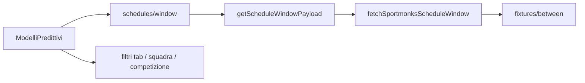

# Piano: scope date (Oggi/Domani/Weekend/7gg), priorità leghe, strategia API filtri

## Stato attuale (breve)

- Il client ([`src/screens/ModelliPredittivi.jsx`](src/screens/ModelliPredittivi.jsx)) chiama [`getScheduleWindow(14)`](src/api/football.js) → [`GET /api/football/schedules/window?days=…`](src/app/api/football/schedules/window/route.js) → [`getScheduleWindowPayload`](src/server/football/service.js) → [`fetchSportmonksScheduleWindow`](src/lib/providers/sportmonks/index.js) (`fixtures/between/{from}/{to}`).
- I tab **Oggi / Domani / Weekend** (e **Tutti**) filtrano **solo in memoria** con [`getMatchStatusBucket`](src/lib/football-filters.js); non cambiano la finestra API.
- L’ordinamento “piano leghe” usa [`sortMatchesByFeaturedPriority`](src/lib/football-filters.js) + [`SPORTMONKS_PRIORITY_LEAGUE_IDS`](src/lib/sportmonks-priority-league-ids.js).

## 1. Data range: non “tutto aperto”, solo Oggi / Domani / Weekend / 7gg

**Obiettivo prodotto:** niente sensazione di “14 giorni aperti”; quattro preset chiari.

**Scelta UX consigliata (due livelli):**

| Livello | Comportamento |
|--------|----------------|
| **Preset tab** | Sostituire o affiancare **“Tutti”** con **“7 giorni”** (etichetta esplicita): il feed caricato copre al massimo **7 giorni** da oggi (allineato a [`SPORTMONKS_SCHEDULE_DAYS`](src/lib/providers/sportmonks/index.js) / param `days`). |
| **Tab temporali** | **Oggi / Domani / Weekend** continuano come **filtri client** sulla lista già scaricata (nessuna nuova chiamata al cambio tab), oppure — variante “stretta” — al cambio tab si ricalcola solo il subset (sempre senza seconda fetch se i dati sono già nel buffer 7gg). |

**Modifiche tecniche previste:**

- Impostare il fetch Modelli a **`days=7`** (e/o default env `SPORTMONKS_SCHEDULE_DAYS=7`) così il server non scarica più 14 giorni se non serve.
- Aggiornare [`STATUS_TABS`](src/screens/ModelliPredittivi.jsx): es. `all` → `seven` con label **“7 gg”** (o **“Prossimi 7 giorni”**), e copy coerente nel sottotitolo [`PageIntro`](src/screens/ModelliPredittivi.jsx).
- Verificare che [`getMatchStatusBucket`](src/lib/football-filters.js) + `kickoff_at` sul match ([normalizzazione in `sportmonks/index.js`](src/lib/providers/sportmonks/index.js)) coprano bene Weekend con fuso **Europe/Rome** (già introdotto in precedenza).

## 2. Ordinamento per priorità “nel modo migliore” con env

**Obiettivo:** ordine leghe **stabile e configurabile** senza toccare il codice ogni volta.

**Approccio consigliato:**

1. **Unica fonte di verità ordinata**: array di ID Sportmonks in [`src/lib/sportmonks-priority-league-ids.js`](src/lib/sportmonks-priority-league-ids.js) nell’ordine desiderato (Top 5 → Step 2 → Serie B → coppe UEFA → Sud America, come da brief business).
2. **Override opzionale via env** `SPORTMONKS_SCHEDULE_LEAGUE_IDS` / variabile dedicata **solo ordine** (se si preferisce non ricompilare): documentare in [`README.md`](README.md) che l’ordine della lista nell’env **deve** seguire la priorità voluta se usata per sort (oggi `sortMatchesByFeaturedPriority` usa l’**indice** nella lista prioritaria).
3. [`sortMatchesByFeaturedPriority`](src/lib/football-filters.js) resta il motore; eventuale affinamento: tie-breaker già presenti (stato, tier competizione, coverage, confidenza, orario).

## 3. Filtri: quando richiamare le API Sportmonks e quando no

| Filtro | Strategia consigliata | Motivo |
|--------|----------------------|--------|
| **Finestra date (7gg vs sotto-insieme Oggi/Domani/Weekend)** | **Una** chiamata `fixtures/between` per la finestra massima concordata (es. 7g); i tab restringono **in client**. | Meno chiamate, stessa quota API; UX reattiva. |
| **Restrizione leghe (whitelist piano)** | Applicare **`filters=fixtureLeagues:…`** lato [`getSportmonksFixtureLeaguesFilterParam`](src/lib/providers/sportmonks/index.js) + lista ID in env, così il **payload** contiene già solo quelle competizioni. | Meno pagine da paginare, meno rischio troncamento; allineato al brief “solo queste leghe”. |
| **Competizione / Value / sort** | **Solo client** sulla lista normalizzata. | Nessun beneficio a rifetch se i dati sono già nel set 7gg. |
| **Ricerca squadra** | **Client** su home/away/short se il dataset è il buffer 7gg; **API aggiuntiva** solo se in futuro serve cercare oltre la finestra o team non presenti nel dump. | Sportmonks espone endpoint per fixture per team/periodo: andrebbe verificata la doc per `filters` o endpoint dedicati prima di integrare. |

**Quando ha senso una nuova chiamata server:**

- Cambio **preset temporale “massimo”** (es. da 7g a 3g) o cambio **whitelist leghe** in env → invalidazione cache / nuovo `getScheduleWindowPayload`.
- Opzione avanzata (solo se necessario per volume o rate limit): **chunk** multipli `fixtures/between` (es. due finestre da 3–4 giorni) merge + dedup — da valutare dopo metriche.

## 4. Aggiornamento TODO operativo

Aggiungere in [`TODO_SVILUPPO_TOP_FOOTBALL_DATA.txt`](TODO_SVILUPPO_TOP_FOOTBALL_DATA.txt) (o file TODO dedicato che usate) una sezione **Backlog feed Modelli (2026)** con voci:

- [ ] Tab e copy: **Oggi / Domani / Weekend / 7gg** (rimuovere o ridefinire “Tutti”).
- [ ] Default fetch **7 giorni** (allineare `getScheduleWindow`, env `SPORTMONKS_SCHEDULE_DAYS`, altre schermate se devono restare a 14).
- [ ] Whitelist leghe + **ordine priorità** in `sportmonks-priority-league-ids.js` / env, coerente con `fixtureLeagues`.
- [ ] Verifica **pagination** / `SPORTMONKS_SCHEDULE_MAX_PAGES` dopo restringimento leghe.
- [ ] (Opzionale) Endpoint o `filters` Sportmonks per **ricerca squadra** oltre il buffer — solo dopo analisi doc e budget API.

## 5. Rischi e dipendenze

- **ID leghe Sportmonks** devono essere corretti per ogni competizione (whitelist); errori di ID escludono leghe intere.
- Allineare **Dashboard / Landing / Navbar** se oggi usano `getScheduleWindow(14)`: decidere se tutto il sito passa a 7g o solo Modelli.
- **Cache server** su `getScheduleWindowPayload`: cambiare `days` o filtri invalida chiavi cache (già per `days` nel service).
