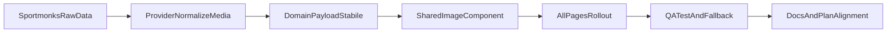

# Piano integrazione immagini Sportmonks (all pages, profilo bilanciato)

## Obiettivo
Portare loghi/foto in tutto il prodotto con un contratto dati normalizzato e riusabile, evitando regressioni e rework futuri.

## Scelte fissate
- Scope: **tutte le pagine/aree** dove compaiono team, player, competizioni.
- Strategia: **bilanciata** (render ottimizzato, fallback robusti, niente dipendenze da raw payload in UI).

## 1) Standardizzare il contratto media nel provider
Aggiornare il normalizer Sportmonks in [`src/lib/providers/sportmonks/index.js`](c:\Users\ET\Downloads\Works\top-football-data\src\lib\providers\sportmonks\index.js) per esporre campi immagine coerenti su:
- Team home/away
- League/competition
- Player (lineups/squads/scorers)
- Coach/referee (allineamento naming)

Campi target consigliati:
- `media.imageUrl` (URL principale)
- opzionale `media.thumbUrl` (se disponibile)
- mantenere `providerIds` per tracciabilità

Nota: continuare a usare gli include già presenti (`participants`, `league`, `player`), senza introdurre nuove API obbligatorie in prima fase.

## 2) Stabilizzare il layer server/domain senza accedere ai raw in UI
Allineare orchestrazione e payload finali in:
- [`src/server/football/service.js`](c:\Users\ET\Downloads\Works\top-football-data\src\server\football\service.js)
- [`src/lib/domain/matches/index.js`](c:\Users\ET\Downloads\Works\top-football-data\src\lib\domain\matches\index.js)
- [`src/lib/domain/fixtures/index.js`](c:\Users\ET\Downloads\Works\top-football-data\src\lib\domain\fixtures\index.js)
- [`src/lib/domain/live/index.js`](c:\Users\ET\Downloads\Works\top-football-data\src\lib\domain\live\index.js)

Obiettivo: le schermate leggono solo campi normalizzati (`*.media.imageUrl`) e non più oggetti provider raw.

## 3) Componente UI condiviso per immagini calcio
Introdurre componente riusabile (team/player/league) con:
- fallback automatico (iniziali/placeholder)
- dimensioni variant (`xs/sm/md`)
- gestione URL assente/rotto
- classi coerenti con UI attuale

Punto di integrazione: cartella shared, es. [`src/components/shared`](c:\Users\ET\Downloads\Works\top-football-data\src\components\shared).

## 4) Rollout UI completo per superfici principali
Applicare immagini dove oggi ci sono iniziali o solo testo:
- [`src/components/match/MatchCard.jsx`](c:\Users\ET\Downloads\Works\top-football-data\src\components\match\MatchCard.jsx)
- [`src/screens/MatchDetail.jsx`](c:\Users\ET\Downloads\Works\top-football-data\src\screens\MatchDetail.jsx)
- [`src/screens/ModelliPredittivi.jsx`](c:\Users\ET\Downloads\Works\top-football-data\src\screens\ModelliPredittivi.jsx)
- [`src/screens/Dashboard.jsx`](c:\Users\ET\Downloads\Works\top-football-data\src\screens\Dashboard.jsx)
- [`src/screens/AnalisiStatistica.jsx`](c:\Users\ET\Downloads\Works\top-football-data\src\screens\AnalisiStatistica.jsx)
- [`src/screens/DatiLive.jsx`](c:\Users\ET\Downloads\Works\top-football-data\src\screens\DatiLive.jsx)
- [`src/screens/Favorites.jsx`](c:\Users\ET\Downloads\Works\top-football-data\src\screens\Favorites.jsx)
- [`src/screens/Following.jsx`](c:\Users\ET\Downloads\Works\top-football-data\src\screens\Following.jsx)
- [`src/screens/MultiBet.jsx`](c:\Users\ET\Downloads\Works\top-football-data\src\screens\MultiBet.jsx)
- [`src/screens/Landing.jsx`](c:\Users\ET\Downloads\Works\top-football-data\src\screens\Landing.jsx)
- [`src/components/layout/Navbar.jsx`](c:\Users\ET\Downloads\Works\top-football-data\src\components\layout\Navbar.jsx)
- [`src/components/stats/PlayerCard.jsx`](c:\Users\ET\Downloads\Works\top-football-data\src\components\stats\PlayerCard.jsx)
- [`src/components/stats/FormationPitch.jsx`](c:\Users\ET\Downloads\Works\top-football-data\src\components\stats\FormationPitch.jsx)

## 5) Performance e robustezza (profilo bilanciato)
- Priorità a immagini remote ottimizzate (componente immagine centralizzato)
- fallback immediato senza layout shift
- evitare richieste duplicate inutili
- mantenere leggibilità in dark mode

## 6) QA e criteri di accettazione
Dataset minimo:
- match con immagini complete
- match con immagini parziali
- match senza immagini
- live + pre-match + fixture detail

Criteri di done:
- nessun crash con URL assenti/invalidi
- nessuna dipendenza UI dai `raw*`
- logo team/league e foto player visibili dove disponibili
- fallback coerenti ovunque
- lint pulito sui file toccati

## 7) Documentazione operativa
Aggiornare documenti con mapping definitivo “API vs calcolo” lato immagini:
- [`README.md`](c:\Users\ET\Downloads\Works\top-football-data\README.md)
- [`TODO_SVILUPPO_TOP_FOOTBALL_DATA.txt`](c:\Users\ET\Downloads\Works\top-football-data\TODO_SVILUPPO_TOP_FOOTBALL_DATA.txt)
- [`TODO_API_E_CALCOLI_FUNZIONI_PIATTAFORMA.txt`](c:\Users\ET\Downloads\Works\top-football-data\TODO_API_E_CALCOLI_FUNZIONI_PIATTAFORMA.txt)
- [`docs/cliente/funzioni-piattaforma.md`](c:\Users\ET\Downloads\Works\top-football-data\docs\cliente\funzioni-piattaforma.md)

## Flusso implementativo

