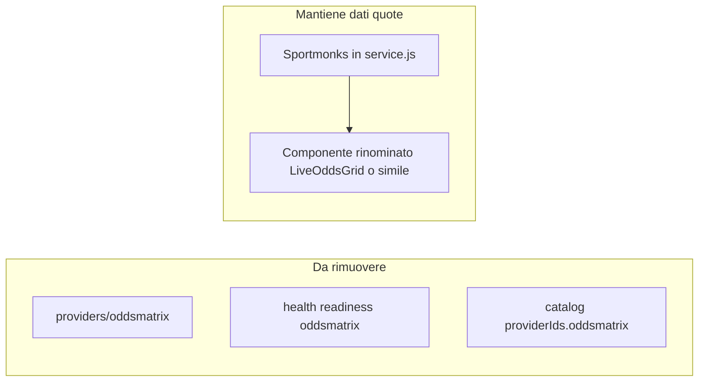

# Piano: niente OddsMatrix (solo Sportmonks)

## Contesto

- **Provider OddsMatrix** è solo uno stub in [`src/lib/providers/oddsmatrix/index.js`](c:\Users\ET\Downloads\Works\top-football-data\src\lib\providers\oddsmatrix\index.js), usato in [`src/app/api/health/route.js`](c:\Users\ET\Downloads\Works\top-football-data\src\app\api\health\route.js) dentro `readiness.providers.oddsmatrix`. Il flag `ok` di health **non** dipende da OddsMatrix (già solo `mongodb && stripe && sportmonks`).
- Il componente [`src/components/live/LiveOddsMatrix.jsx`](c:\Users\ET\Downloads\Works\top-football-data\src\components\live\LiveOddsMatrix.jsx) **non** chiama l’API OddsMatrix: renderizza una tabella di quote da props (`odds`, `oddsProvider`). Il nome crea confusione con il fornitore esterno.

## Modifiche codice

1. **Eliminare** la cartella [`src/lib/providers/oddsmatrix/`](c:\Users\ET\Downloads\Works\top-football-data\src\lib\providers\oddsmatrix) (file `index.js`).

2. **Health** — in [`src/app/api/health/route.js`](c:\Users\ET\Downloads\Works\top-football-data\src\app\api\health\route.js): rimuovere import e variabile `getOddsmatrixProviderReadiness`, e la chiave `oddsmatrix` sotto `readiness.providers` (lasciare solo `sportmonks`).

3. **Catalog** — in [`src/lib/competitions/catalog.js`](c:\Users\ET\Downloads\Works\top-football-data\src\lib\competitions\catalog.js): togliere `oddsmatrix` da `DEFAULT_PROVIDER_IDS` (resta coerente con solo Sportmonks).

4. **UI + naming** — rinominare `LiveOddsMatrix.jsx` in un nome neutro (es. `LiveOddsGrid.jsx` o `LiveOddsPanel.jsx`), aggiornare export e import in [`src/screens/DatiLive.jsx`](c:\Users\ET\Downloads\Works\top-football-data\src\screens\DatiLive.jsx). Nel componente, cambiare titolo visibile da «Live Odds Matrix» a qualcosa tipo «Quote live» / «Live odds» per non richiamare il brand OddsMatrix.

5. **Copy** — in [`src/screens/MultiBet.jsx`](c:\Users\ET\Downloads\Works\top-football-data\src\screens\MultiBet.jsx) (linea che cita OddsMatrix per O/U e comparazione): sostituire con riferimento a **Sportmonks** (pre-match/live odds in base al piano) o al comparatore interno.

## Documentazione (opzionale ma consigliato nello stesso PR)

- Aggiornare riferimenti a OddsMatrix in [`TOP_FOOTBALL_DATA_DOCUMENTO_OPERATIVO_FINALE.txt`](c:\Users\ET\Downloads\Works\top-football-data\TOP_FOOTBALL_DATA_DOCUMENTO_OPERATIVO_FINALE.txt), [`TODO_SVILUPPO_TOP_FOOTBALL_DATA.txt`](c:\Users\ET\Downloads\Works\top-football-data\TODO_SVILUPPO_TOP_FOOTBALL_DATA.txt) e sezione API in [`.cursor/plans/top_football_data_roadmap_325cad79.plan.md`](c:\Users\ET\Downloads\Works\top-football-data\.cursor\plans\top_football_data_roadmap_325cad79.plan.md): strategia **solo Sportmonks** per quote/comparatore; niente integrazione OddsMatrix.

## Env

- Rimuovere da eventuale `.env.example` o doc deploy le variabili `ODDSMATRIX_*` se presenti (grep veloce dopo le modifiche).

## Verifica

- `npm run build` e `npm run lint`.
- `GET /api/health`: JSON senza `oddsmatrix`; `providers` contiene solo `sportmonks`.
