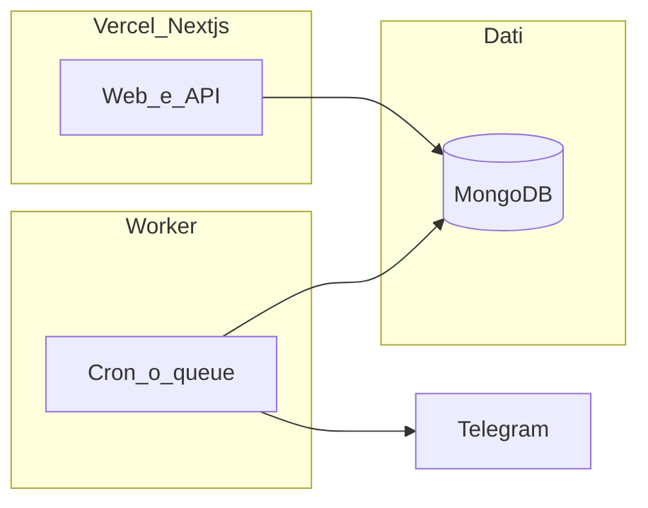

# Roadmap prodotto e tecnica — Funzioni Piattaforma (2026)

**Fonte requisiti testuali:** [`docs/cliente/funzioni-piattaforma.md`](../../docs/cliente/funzioni-piattaforma.md) (estratto strutturato dal documento cliente). Il file `.docx` in root resta riferimento formale.

**App:** Next.js — shell [`src/components/layout/SiteShell.jsx`](../../src/components/layout/SiteShell.jsx), provider Sportmonks [`src/lib/providers/sportmonks/index.js`](../../src/lib/providers/sportmonks/index.js).

---

## 0. Stato repository (completati di cronologia)

| Voce | Stato |
|------|--------|
| Sportradar | Rimosso; nessuna dipendenza nel repo. |
| OddsMatrix stub | Rimosso da health/catalog; quote solo Sportmonks. |
| Feature flag Dati Live | `NEXT_PUBLIC_FEATURE_DATI_LIVE` (solo `true` abilita); [`src/lib/feature-flags.js`](../../src/lib/feature-flags.js); [`src/middleware.js`](../../src/middleware.js) redirect `/dati-live` → `/dashboard` se off; Dashboard/Modelli/Landing senza `getLivescoresInplay` se off. |
| UI aprile 2026 | PageIntro, FeedMetaPanel, ValueBetBadge + `value-bet-display`, pass su Dashboard/MatchDetail/Modelli/Analisi/Multi-bet/Dati Live, ecc. |
| Immagini Sportmonks (loghi/foto) | Contratto `media` + `*_media` nel provider/domain; `FootballMediaImage` su card, schermate principali, timeline live, preferiti/seguiti, navbar search; env `SPORTMONKS_MEDIA_BASE_URL` opzionale; **contrasto UI:** mat chiaro di default sulle immagini remote (tema scuro), `surface` opzionale. |

**Nota Vercel:** variabili `NEXT_PUBLIC_*` richiedono **redeploy** dopo modifica env.

---

## A. Modelli predittivi — singolo match

**Obiettivo cliente:** Prediction API Sportmonks + quote in tempo reale; per 1X2, U/O, GG/NG: probabilità modello, quota modello, badge VALUE quando quota bookmaker > quota modello; xG e top 3 risultati esatti; widget comparatore **4 slot** (top value + 3 bookmaker) con link affiliazione e eventuale +% valore; barre di confidenza; formazioni live → Reliability score; toggle «solo Value Bet»; grafico radar/istogramma Pressure Index.

**Codice oggi:** normalizzazione e `buildDerivedValueBet` in [`sportmonks/index.js`](../../src/lib/providers/sportmonks/index.js); comparatore per match [`OddsComparison.jsx`](../../src/components/match/OddsComparison.jsx); schermate [`ModelliPredittivi.jsx`](../../src/screens/ModelliPredittivi.jsx), [`MatchDetail.jsx`](../../src/screens/MatchDetail.jsx).

**Piano operativo unico Sezione A:** [`sezione_a_modelli_match_8e95b20a.plan.md`](./sezione_a_modelli_match_8e95b20a.plan.md).

- **Fase SAFE (backlog immediato):** solo task eseguibili con feed attuale (payload value matematico su dati presenti, comparatore 4 slot su bookmaker disponibili, rollout UI con fallback espliciti, test su 4 scenari).
- **Fase FULL (dopo API/add-on):** integrazione `predictions/value-bets` e completamento 1:1 del brief.
- **Gate SAFE -> FULL:** (1) add-on contratto confermati, (2) endpoint disponibili su fixture reali, (3) CTA/affiliazioni business approvate, (4) copy UX fallback approvata.

---

## B. Analisi statistica — deep data

**Obiettivo cliente:** formazioni aggiornate (~60 min), penalità se giocatore chiave assente, UI tattica dark; player props (tiri, xG, heatmap se API, disciplina); momentum, xPts, pressure graph, tempi di rete; navigazione a tab (Formazioni / Player stats / Momentum) senza reload; comparatore **context-aware** (es. anytime goalscorer vs player booked); mapping ID giocatore ↔ quote 4 bookmaker; lazy loading quote al click tab giocatore.

**Codice oggi:** [`AnalisiStatistica.jsx`](../../src/screens/AnalisiStatistica.jsx), fixture detail con lineups dove il feed li espone.

**Gap:** endpoint e include Sportmonks per mercati giocatore e aggiornamenti formazioni; nuovo flusso UI tab + comparatore dinamico.

---

## C. Bet multipla — orchestratore

**Obiettivo cliente:** filtro edge per evento, combinazioni 3–4 eventi, EV composto e soglie (es. EV totale ≥ 1.15–1.20); UI con Confidence score, Data edge, probabilità successo; stesso widget comparatore; notifiche (Telegram/push) quando EV > 1.25; pagina **performance storiche** con esiti e ROI, sintesi Telegram.

**Codice oggi:** [`MultiBet.jsx`](../../src/screens/MultiBet.jsx); [`GET /api/football/odds/futures`](../../src/app/api/football/odds/futures/route.js) **placeholder** (`source: not_implemented`).

**Gap:** integrazione outrights/futures Sportmonks; motore EV in backend o job; persistenza suggerimenti e esiti in Mongo; worker notifiche.

---

## D. Trasversali (compliance, growth, pricing)

- **CTA / affiliazione:** il cliente segnala possibile divieto sulla dicitura «Gioca ora» — definire copy alternativa a call-to-action chiara.
- **GEO / AI:** visibilità su motori e assistenti (scope da definire con marketing).
- **Premium:** [`Premium.jsx`](../../src/screens/Premium.jsx) va allineato alle feature vendute (comparatore, multi-bet engine) quando implementate.
- **Area pubblica:** oltre [`Landing.jsx`](../../src/screens/Landing.jsx), layout marketing opzionale e pagine legali/FAQ (vedi backlog).

---

## API — route Next e Sportmonks

Riferimenti: [`src/lib/providers/sportmonks/index.js`](../../src/lib/providers/sportmonks/index.js), [`src/server/football/service.js`](../../src/server/football/service.js), [`src/api/football.js`](../../src/api/football.js).

### Tabella route `/api/football/*`

| Route Next | Usata da (indicativo) | Funzione service | Chiamate Sportmonks v3 |
|------------|------------------------|------------------|-------------------------|
| `GET /api/football/schedules/window` | Dashboard, Modelli, Analisi, search, Favorites, Following, Landing | `getScheduleWindowPayload` | `GET fixtures/between/{from}/{to}` + `include` (`SPORTMONKS_SCHEDULE_INCLUDE_ATTEMPTS`); filtro leghe opzionale `SPORTMONKS_SCHEDULE_*` |
| `GET /api/football/fixtures/[fixtureId]` | Match detail, Analisi | `getFixturePayload` | `GET fixtures/{id}` + include; `GET standings/seasons/{seasonId}`; `GET squads/teams/{teamId}` |
| `GET /api/football/livescores/inplay` | Dati Live (se flag); Dashboard/Modelli/Landing **solo se** flag on | `getLivescoresInplayPayload` | `GET livescores/inplay` o `GET livescores/latest` |
| `GET /api/football/odds/futures` | Multi-bet | — | **Nessuna** — placeholder fino a outrights SM |

### Include tipici

Il client prova più set di `include` in cascata. Esempi: `league`, `season`, `participants`, `scores`, `odds.bookmaker`, `statistics.type`, `lineups.details.type`, `referees`, `coaches`, `formations`, …

Senza add-on **Odds**, le quote possono mancare. Senza **Predictions** completi, il normalizzatore usa derivazioni e `buildSportmonksPlanNotice` in `service.js`.

### Endpoint Sportmonks usati nel codice (path v3)

Prefisso: `https://api.sportmonks.com/v3/football/` (`SPORTMONKS_BASE_URL`).

1. `fixtures/between/{from}/{to}`
2. `fixtures/{id}`
3. `standings/seasons/{seasonId}`
4. `squads/teams/{teamId}`
5. `livescores/inplay`
6. `livescores/latest`

**Backlog chiamate dedicate:** `GET .../football/predictions/value-bets` e `.../value-bets/fixtures/{fixture_id}` (add-on **Predictions**). Tutorial: [Value Bet](https://docs.sportmonks.com/v3/tutorials-and-guides/tutorials/odds-and-predictions/predictions/value-bet). La UI value attuale usa **`buildDerivedValueBet`**, non questa API.

### Aree senza feed calcio esterno

| Area | Fonte |
|------|--------|
| Auth, account, watchlist, following | MongoDB + Better Auth — `/api/auth`, `/api/account/*` |
| Stripe | `/api/billing/*` |
| Lead | `POST /api/leads` |
| Admin | `/api/admin/users` |
| Health | `/api/health` |
| Multi-bet (fino a integrazione) | UI + futures placeholder |
| Comparatore | Odds nei payload fixture/schedule se il piano SM espone |

### Gap contratto Sportmonks

| Esigenza | Nota |
|----------|------|
| Futures / outrights | Sostituire placeholder in `odds/futures/route.js` |
| Quote pre-match / più bookmaker | Add-on Odds — [Plans & pricing](https://www.sportmonks.com/football-api/plans-pricing/) |
| Predictions / value ufficiali | Add-on Predictions; `predictions/value-bets` vs `buildDerivedValueBet` |
| xG / expected | Verificare payload e include |
| Live odds bookmaker | Spesso add-on; legato a Dati Live |
| Rate limit / leghe | Filtro in `getSportmonksFixtureLeaguesFilterParam` |
| Matrice costi | Creare `docs/sportmonks-matrix.md` (todo `debt-sportmonks-contract`) |

Documentazione: [Football API v3](https://docs.sportmonks.com/v3/), [Predictions](https://docs.sportmonks.com/v3/tutorials-and-guides/tutorials/odds-and-predictions/predictions), [Value Bet](https://docs.sportmonks.com/v3/tutorials-and-guides/tutorials/odds-and-predictions/predictions/value-bet).

---

## Infrastruttura — Telegram, worker, Mongo

**Alert e ROI:** il documento cliente richiede notifiche su soglia EV e storico performance. Pattern consigliato: worker (es. Python su Railway) con Telegram Bot API; dedup su chiave evento/soglia; Mongo per outbox/log suggerimenti ed esiti; opzionale chiamata API Next con service token.

**Pulsanti Telegram in app:** env tipo `NEXT_PUBLIC_TELEGRAM_URL` in Navbar/Footer (todo `telegram-ui`).

---

## Ordine di lavoro suggerito

1. Validare piano Sportmonks vs `debt-sportmonks-contract` (matrice add-on + `docs/sportmonks-matrix.md`).
2. **Sez. A (SAFE):** eseguire solo backlog immediato del piano unico (`sezione_a_modelli_match_8e95b20a.plan.md`) senza dipendenze da API mancanti.
3. **Gate Sez. A -> FULL:** passare all'integrazione `predictions/value-bets` solo dopo conferma add-on/endpoint reali + CTA/affiliazioni.
4. **Comparatore globale** in shell dove ha senso (contesto match da schedule).
5. **Sez. B:** tab + lazy load; mercati giocatore quando endpoint disponibili.
6. **Sez. C:** sostituire placeholder futures; orchestratore EV; poi notifiche e pagina performance.
7. Premium/copy, Telegram UI, worker, area pubblica in parallelo o a valle.

---

## Documenti operativi

- [`TODO_SVILUPPO_TOP_FOOTBALL_DATA.txt`](../../TODO_SVILUPPO_TOP_FOOTBALL_DATA.txt)
- [`TODO_API_E_CALCOLI_FUNZIONI_PIATTAFORMA.txt`](../../TODO_API_E_CALCOLI_FUNZIONI_PIATTAFORMA.txt)
- [`README.md`](../../README.md)
- [`TOP_FOOTBALL_DATA_DOCUMENTO_OPERATIVO_FINALE.txt`](../../TOP_FOOTBALL_DATA_DOCUMENTO_OPERATIVO_FINALE.txt) (se presente)
