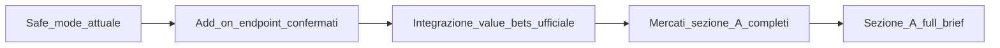

# Sezione A — Piano unico consolidato

## Decisione operativa

Manteniamo **un solo piano Sezione A** con due blocchi espliciti:

1. **Fase SAFE (eseguibile subito)**: solo attività possibili con feed/API già disponibili.
2. **Fase FULL (post API/add-on)**: completamento 1:1 del brief cliente quando saranno disponibili endpoint/add-on mancanti.

Regola cliente non negoziabile: dove il brief chiede API Sportmonks, la fonte primaria resta API Sportmonks; i calcoli derivati si usano per quota modello/value matematico o fallback tecnico dichiarato.

---

## Fase SAFE (ora)

### Obiettivo

Consegna incrementale stabile senza blocchi esterni.

### Ambito

- Consolidare payload in [`src/lib/providers/sportmonks/index.js`](src/lib/providers/sportmonks/index.js):
  - probabilità già disponibili,
  - quota modello derivata `1/p`,
  - best odds bookmaker dal feed attuale,
  - value % quando dati completi.
- Comparatore 4 slot in [`src/components/match/OddsComparison.jsx`](src/components/match/OddsComparison.jsx) usando solo bookmaker già presenti.
- UI Sezione A in [`src/screens/MatchDetail.jsx`](src/screens/MatchDetail.jsx), [`src/components/match/MatchCard.jsx`](src/components/match/MatchCard.jsx), [`src/screens/ModelliPredittivi.jsx`](src/screens/ModelliPredittivi.jsx) con fallback espliciti.
- Test matrice minima (odds+pred, solo odds, solo pred, fallback).

### Done SAFE

- Nessuna regressione su Modelli/MatchDetail.
- Comparatore 4 slot funzionante su dati correnti.
- Distinzione chiara in UI tra dati completi e fallback.
- Confidenza con sorgente esplicita: API quando disponibile, fallback composito interno in assenza.
- Evidenziazione value bet allineata tra lista e MatchDetail su tutti i mercati disponibili (1X2, O/U, GG/NG).

---

## Gate per passare da SAFE a FULL

Passiamo alla fase FULL solo quando tutti i gate sono soddisfatti:

1. **Gate contratto**: conferma add-on Sportmonks attivi (almeno Odds + Predictions necessari per Sezione A completa).
2. **Gate endpoint**: endpoint ufficiali richiesti dal brief disponibili e verificati su fixture reali.
3. **Gate business**: mappa affiliazioni bookmaker e label CTA legale approvate.
4. **Gate UX**: copy e stati empty/fallback approvati per scenario API incompleto.

---

## Fase FULL (quando API mancanti sono disponibili)

### Trigger di ingresso

- Conferma add-on/piano Sportmonks (Odds/Predictions/value-bets/mercati necessari).
- Disponibilità endpoint ufficiali richiesti dal brief.

### Ambito

- Integrare `predictions/value-bets` con sorgente ufficiale in payload/UI.
- Estendere mercati/comparatore secondo brief completo.
- Portare Sezione A a piena aderenza cliente su fonte dati API primaria.

### Done FULL

- Sezione A allineata al brief cliente completo senza fallback dominante.
- Label sorgente dati chiara (`sportmonks_api` vs `fallback_derivato`).

---

## Flusso operativo SAFE -> FULL

---

## Criteri di successo complessivi

- SAFE: valore e comparatore affidabili sui dati già presenti, senza regressioni.
- FULL: copertura funzionale aderente al documento cliente in `docs/cliente/funzioni-piattaforma.md`.
