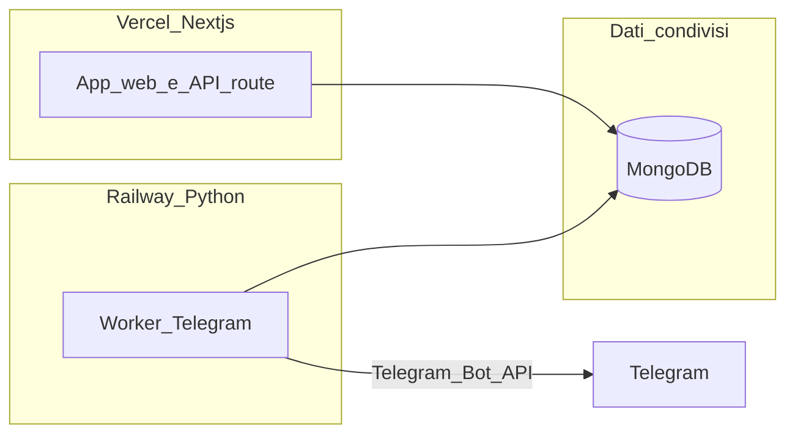

# Roadmap prodotto e tecnica — Top Football Data

## Piani operativi per step (dettaglio)

Ogni step primario ha un piano dedicato — indice: [`.cursor/plans/plan-00-indice-step-primari.md`](plan-00-indice-step-primari.md). Step 0 (Sportradar) **completato**: [`plan-00-sportradar-removal.md`](plan-00-sportradar-removal.md).

## Contesto dal codice attuale

- **Sportradar:** **nessuna dipendenza né codice** nel repo (rimosso). `GET /api/football/odds/futures` è un **placeholder** fino a integrazione outrights Sportmonks. Rimuovere eventuali `SPORTRADAR_*` rimaste solo su Vercel/env locali.

- App **Next.js 16** ([`package.json`](c:\Users\ET\Downloads\Works\top-football-data\package.json)), shell comune in [`SiteShell.jsx`](c:\Users\ET\Downloads\Works\top-football-data\src\components\layout\SiteShell.jsx) (Navbar + main + Footer).
- Navigazione privata: [`Navbar.jsx`](c:\Users\ET\Downloads\Works\top-football-data\src\components\layout\Navbar.jsx) — la voce **Dati Live** è visibile solo se `NEXT_PUBLIC_FEATURE_DATI_LIVE=true` ([`feature-flags.js`](c:\Users\ET\Downloads\Works\top-football-data\src\lib\feature-flags.js)).
- **Dati Live**: schermo [`DatiLive.jsx`](c:\Users\ET\Downloads\Works\top-football-data\src\screens\DatiLive.jsx), route [`(app)/dati-live/page.jsx`](c:\Users\ET\Downloads\Works\top-football-data\src\app\(app)\dati-live\page.jsx), API `GET /api/football/livescores/inplay` ([`inplay/route.js`](c:\Users\ET\Downloads\Works\top-football-data\src\app\api\football\livescores\inplay\route.js)), middleware [`src/middleware.js`](c:\Users\ET\Downloads\Works\top-football-data\src\middleware.js) (redirect a `/dashboard` se flag off).
- **Fetch livescore in background:** [`Dashboard.jsx`](c:\Users\ET\Downloads\Works\top-football-data\src\screens\Dashboard.jsx), [`ModelliPredittivi.jsx`](c:\Users\ET\Downloads\Works\top-football-data\src\screens\ModelliPredittivi.jsx), [`Landing.jsx`](c:\Users\ET\Downloads\Works\top-football-data\src\screens\Landing.jsx) chiamano `getLivescoresInplay()` **solo** quando il feature flag è attivo; altrimenti nessuna hit a livescore da quelle pagine.
- **Comparatore**: componente [`OddsComparison.jsx`](c:\Users\ET\Downloads\Works\top-football-data\src\components\match\OddsComparison.jsx); oggi è contestuale al match, mentre [`Premium.jsx`](c:\Users\ET\Downloads\Works\top-football-data\src\screens\Premium.jsx) elenca ancora «Comparatore quote match-by-match» come **non incluso** (allineamento commerciale da definire).
- **Multi-bet**: [`MultiBet.jsx`](c:\Users\ET\Downloads\Works\top-football-data\src\screens\MultiBet.jsx) con logica premium e copy che rimanda al comparatore; va chiarito cosa è MVP vs post-MVP.
- **SportMonks**: client e normalizzazione in [`src/lib/providers/sportmonks/index.js`](c:\Users\ET\Downloads\Works\top-football-data\src\lib\providers\sportmonks\index.js); mappa concettuale provider in [`src/lib/provider-config.js`](c:\Users\ET\Downloads\Works\top-football-data\src\lib\provider-config.js). Documentazione interna: [`TOP_FOOTBALL_DATA_DOCUMENTO_OPERATIVO_FINALE.txt`](c:\Users\ET\Downloads\Works\top-football-data\TOP_FOOTBALL_DATA_DOCUMENTO_OPERATIVO_FINALE.txt), [`TODO_SVILUPPO_TOP_FOOTBALL_DATA.txt`](c:\Users\ET\Downloads\Works\top-football-data\TODO_SVILUPPO_TOP_FOOTBALL_DATA.txt), [`README.md`](c:\Users\ET\Downloads\Works\top-football-data\README.md).

**Nota sui file cliente:** la cartella «Documenti del cliente» non risulta nel workspace aperto. Per allineamento testuale con Carlo, conviene **copiare i due file nel repo** (es. `docs/cliente/`) o incollarne il contenuto in un issue — così il piano operativo non dipende da percorsi locali.

---

## 0. Rimozione dipendenze Sportradar — **COMPLETATO**

Implementato: nessun pacchetto Sportradar, nessun fallback nel servizio football, health senza `sportradar`, domain/UI ripuliti, README aggiornato. Futures API = placeholder. Dettaglio e verifica: [`plan-00-sportradar-removal.md`](plan-00-sportradar-removal.md).

---

## 1. Nascondere «Dati Live» — **COMPLETATO**

**Implementato (aprile 2026):** feature flag `NEXT_PUBLIC_FEATURE_DATI_LIVE` (abilitato solo se valore esattamente `true`; default assente = spento). Dettaglio: [`plan-01-dati-live-flag.md`](plan-01-dati-live-flag.md).

- Helper: [`src/lib/feature-flags.js`](c:\Users\ET\Downloads\Works\top-football-data\src\lib\feature-flags.js) (`isDatiLiveFeatureEnabled`).
- **Middleware:** [`src/middleware.js`](c:\Users\ET\Downloads\Works\top-football-data\src\middleware.js) — con flag off, redirect `/dati-live` → `/dashboard`.
- **Navbar** [`Navbar.jsx`](c:\Users\ET\Downloads\Works\top-football-data\src\components\layout\Navbar.jsx): voce Dati Live nascosta se flag off.
- **Fetch:** [`Dashboard.jsx`](c:\Users\ET\Downloads\Works\top-football-data\src\screens\Dashboard.jsx), [`ModelliPredittivi.jsx`](c:\Users\ET\Downloads\Works\top-football-data\src\screens\ModelliPredittivi.jsx), [`Landing.jsx`](c:\Users\ET\Downloads\Works\top-football-data\src\screens\Landing.jsx) non chiamano `getLivescoresInplay()` quando il flag è off; [`DatiLive.jsx`](c:\Users\ET\Downloads\Works\top-football-data\src\screens\DatiLive.jsx) non avvia polling se disabilitato.
- **Documentazione:** [`README.md`](c:\Users\ET\Downloads\Works\top-football-data\README.md), [`TODO_SVILUPPO_TOP_FOOTBALL_DATA.txt`](c:\Users\ET\Downloads\Works\top-football-data\TODO_SVILUPPO_TOP_FOOTBALL_DATA.txt).

**Riattivazione:** impostare `NEXT_PUBLIC_FEATURE_DATI_LIVE=true` (locale `.env.local` o Vercel) e **redeploy**; su Vercel non serve creare la variabile se la funzione resta spenta.

---

## 2. UI più minimal (schede, tab, widget)

Approccio incrementale per non riscrivere tutto:

- **Principi:** una sola gerarchia visiva per pagina (titolo + 1 CTA primaria); ridurre testo ripetuto tra `SectionHeader`, chip e card; collassare dettagli secondari in accordion o «Dettagli».
- **Priorità file (alta densità):** [`Dashboard.jsx`](c:\Users\ET\Downloads\Works\top-football-data\src\screens\Dashboard.jsx), [`ModelliPredittivi.jsx`](c:\Users\ET\Downloads\Works\top-football-data\src\screens\ModelliPredittivi.jsx), [`AnalisiStatistica.jsx`](c:\Users\ET\Downloads\Works\top-football-data\src\screens\AnalisiStatistica.jsx), [`MatchDetail.jsx`](c:\Users\ET\Downloads\Works\top-football-data\src\screens\MatchDetail.jsx), [`MultiBet.jsx`](c:\Users\ET\Downloads\Works\top-football-data\src\screens\MultiBet.jsx).
- **Pattern riusabile:** estrarre dove ha senso un piccolo set di componenti (`PageToolbar`, `SummaryStrip`, card «solo metriche») per evitare 5 `GlassCard` equivalenti nella stessa viewport.

---

## 3. Telegram: pulsante in header e footer

- **Config:** URL canale/gruppo in env (es. `NEXT_PUBLIC_TELEGRAM_URL` o simile) così cambia senza deploy di copy.
- **Navbar:** bottone/icona accanto al brand o nella zona azioni (coerente con mobile: stesso entry point nel menu hamburger).
- **Footer:** oggi [`Footer.jsx`](c:\Users\ET\Downloads\Works\top-football-data\src\components\layout\Footer.jsx) è solo brand + legal; aggiungere riga link social con Telegram + eventuali note legali cliccabili (oggi sono `span` non link — si può collegare a route `/privacy` e `/termini` quando esistono).

---

## 4. Comparatore visibile su ogni pagina (area privata)

Il comparatore vero è **per fixture** ([`OddsComparison.jsx`](c:\Users\ET\Downloads\Works\top-football-data\src\components\match\OddsComparison.jsx)). Per «sempre visibile» servono due livelli:

1. **Shell globale** (in [`SiteShell.jsx`](c:\Users\ET\Downloads\Works\top-football-data\src\components\layout\SiteShell.jsx)): barra sotto la navbar o **CTA sticky** «Comparatore quote» che:
   - su `/match/[id]` scrolla alla sezione odds / focus;
   - sulle altre pagine porta al **match “corrente”** (es. primo della dashboard o ultimo visitato in `sessionStorage`) oppure apre un mini-picker (2–3 partite top del giorno da `getScheduleWindow`).
2. **Dati:** riusare odds già normalizzate nel payload schedule/fixture (stesso flusso SportMonks già usato per le card) per evitare N+1 chiamate; definire limite di refresh.

Questo soddisfa l’esigenza UX senza duplicare tutta la tabella su ogni view.

---

## 5. API — stato integrazioni, gap e Sportmonks

Riferimenti codice: [`src/lib/providers/sportmonks/index.js`](c:\Users\ET\Downloads\Works\top-football-data\src\lib\providers\sportmonks\index.js), [`src/server/football/service.js`](c:\Users\ET\Downloads\Works\top-football-data\src\server\football\service.js), [`src/api/football.js`](c:\Users\ET\Downloads\Works\top-football-data\src\api\football.js).

### 5.1 Route Next `/api/football/*` e Sportmonks

| Route Next | Usata da (indicativo) | Funzione service | Chiamate Sportmonks Football API v3 |
|------------|------------------------|------------------|--------------------------------------|
| `GET /api/football/schedules/window` | Dashboard, Modelli, Analisi, Navbar search, Favorites, Following, Landing | `getScheduleWindowPayload` | `GET fixtures/between/{from}/{to}` + `include` (tentativi in [`SPORTMONKS_SCHEDULE_INCLUDE_ATTEMPTS`](c:\Users\ET\Downloads\Works\top-football-data\src\lib\providers\sportmonks\index.js)); filtro leghe opzionale env `SPORTMONKS_SCHEDULE_*` |
| `GET /api/football/fixtures/[fixtureId]` | Match detail, Analisi | `getFixturePayload` | `GET fixtures/{id}` + include; poi `GET standings/seasons/{seasonId}`; `GET squads/teams/{teamId}` per casa e trasferta |
| `GET /api/football/livescores/inplay` | Dati Live (se flag on); Dashboard/Modelli/Landing **solo se** `NEXT_PUBLIC_FEATURE_DATI_LIVE=true` | `getLivescoresInplayPayload` | `GET livescores/inplay` (sync completo) oppure `GET livescores/latest` (delta) |
| `GET /api/football/odds/futures` | Multi-bet | nessuna integrazione | **Nessuna** — risposta placeholder [`source: not_implemented`](c:\Users\ET\Downloads\Works\top-football-data\src\app\api\football\odds\futures\route.js); servono endpoint/outrights da definire in documentazione Sportmonks e implementare |

### 5.2 Cosa chiediamo al feed (`include`)

Il client prova più set di `include` in cascata se la richiesta fallisce. Tipicamente: `league`, `season`, `round`, `state`, `participants`, `venue`, `scores`, **`odds.bookmaker`**, `statistics.type`, `metadata`, e sul dettaglio anche `periods`, `events.type`, `lineups.details.type`, `referees`, `coaches`, `formations`, …

**Effetto contratto:** senza add-on **Odds**, le quote nei JSON possono mancare → comparatore / card vuote o incomplete. Senza **Predictions** / dati **expected** nel payload, il normalizzatore usa **derivazioni interne** e messaggi tipo «piano non include …» (`buildSportmonksPlanNotice` in [`service.js`](c:\Users\ET\Downloads\Works\top-football-data\src\server\football\service.js)).

### 5.3 Elenco endpoint Sportmonks usati nel codice (path v3)

Prefisso tipico: `https://api.sportmonks.com/v3/football/` (override: `SPORTMONKS_BASE_URL`).

1. `fixtures/between/{from}/{to}`
2. `fixtures/{id}`
3. `standings/seasons/{seasonId}`
4. `squads/teams/{teamId}`
5. `livescores/inplay`
6. `livescores/latest`

Non risultano nel repo chiamate HTTP dedicate solo a endpoint «predictions» se non già inclusi nelle risposte fixture/schedule (dipende da risposta reale e add-on).

### 5.4 Aree del prodotto senza API dati calcio esterna

| Area | Fonte dati |
|------|------------|
| Auth, sessione, account, watchlist, following, preferenze | MongoDB + Better Auth — [`/api/auth`](c:\Users\ET\Downloads\Works\top-football-data\src\app\api\auth), [`/api/account/*`](c:\Users\ET\Downloads\Works\top-football-data\src\app\api\account) |
| Stripe / abbonamento Premium | [`/api/billing/*`](c:\Users\ET\Downloads\Works\top-football-data\src\app\api\billing) |
| Lead landing | [`POST /api/leads`](c:\Users\ET\Downloads\Works\top-football-data\src\app\api\leads) |
| Admin utenti | [`/api/admin/users`](c:\Users\ET\Downloads\Works\top-football-data\src\app\api\admin) |
| Health | [`/api/health`](c:\Users\ET\Downloads\Works\top-football-data\src\app\api\health) — readiness Mongo, Stripe, token Sportmonks |
| Multi-bet (combo, testi) | Logica/UI locale + futures **senza** Sportmonks finché il placeholder non è sostituito |
| Comparatore quote | Dati da **odds** nei payload schedule/fixture se il piano SM li espone |

### 5.5 Altri servizi fuori dal feed calcio

- **Bot Telegram / alert automatici:** fuori da questo monorepo (worker pianificato a parte).

### 5.6 Gap: cosa manca o va confermato sul contratto Sportmonks

| Esigenza | Nota |
|----------|------|
| **Futures / outrights** (Multi-bet) | Implementare chiamate v3 e sostituire [`odds/futures/route.js`](c:\Users\ET\Downloads\Works\top-football-data\src\app\api\football\odds\futures\route.js) |
| **Quote pre-match per comparatore** | Add-on **Odds** (o **Premium Odds** per più bookmaker) — [Plans & pricing](https://www.sportmonks.com/football-api/plans-pricing/) |
| **Predictions / value ufficiali SM** | Add-on **Predictions** |
| **xG / expected dal provider** | Verificare che il piano espanda il payload fixture o servano include aggiuntivi |
| **Live odds bookmaker** (non solo derivate) | Spesso add-on separato; collegato alla pagina Dati Live |
| **Piano leghe / rate limit** | Base Starter/Growth/Pro; filtro [`getSportmonksFixtureLeaguesFilterParam`](c:\Users\ET\Downloads\Works\top-football-data\src\lib\providers\sportmonks\index.js) per ridurre perimetro |
| **Matrice costi scritta** | Estendere sezione 5 o creare `docs/sportmonks-matrix.md` (todo `sportmonks-matrix` nel frontmatter) con costi stimati per scenario |

Link documentazione: [Football API v3](https://docs.sportmonks.com/v3/), [Predictions](https://docs.sportmonks.com/v3/tutorials-and-guides/tutorials/odds-and-predictions/predictions).

---

## 6. Premium, Multi-bet e promesse in pagina prezzi

- **Stato attuale:** [`Premium.jsx`](c:\Users\ET\Downloads\Works\top-football-data\src\screens\Premium.jsx) mostra ancora Multi-bet engine e comparatore come **non inclusi** nel piano pagato — va **allineato** con ciò che il cliente vende dopo i lavori su comparatore e motore combo.
- **Multi-bet:** definire con il cliente: è un costruttore di schedina da probabilità interne? da predictions SM? regole di rischio? Poi aggiornare [`MultiBet.jsx`](c:\Users\ET\Downloads\Works\top-football-data\src\screens\MultiBet.jsx) e i gate `isPremium` in [`AppContext.jsx`](c:\Users\ET\Downloads\Works\top-football-data\src\lib\AppContext.jsx) / Stripe.
- **Stripe:** già integrato ([`src/lib/stripe.js`](c:\Users\ET\Downloads\Works\top-football-data\src\lib\stripe.js), API billing) — il lavoro è soprattutto **copy e permessi feature**.

---

## 7. Bot Telegram (soglia probabilità) e architettura backend

**Requisito funzionale tipico:** un processo schedulato o event-driven che:
1. Legge le partite/probabilità già calcolate o da SM (stesso dominio dati dell’app).
2. Confronta con **soglia configurabile** (es. probabilità 1X2 o mercato scelto > X%).
3. Invia messaggio sul canale Telegram se non già inviato (dedup su `fixture_id + market + threshold`).

### Raccomandazione architetturale (pragmatica)

Non è obbligatorio separare **tutto** frontend/backend per avere il bot. Pattern che scala bene:

- **Next su Vercel:** resta fonte di verità per auth, Stripe, proxy Sportmonks, normalizzazione — già presente.
- **Worker Python su Railway:** solo **long-running** o **cron** + libreria tipo `python-telegram-bot` / Aiogram; gestione segreti `TELEGRAM_BOT_TOKEN`, webhook o polling.
- **Condivisione dati:** il worker legge da **MongoDB** (stessa collection delle «prediction jobs» o snapshot giornaliero) oppure chiama API interne Next con **service token** (HMAC o API key rotabile).

**Quando ha senso un monorepo separato «api»:** se il team vuole API pubbliche stabili non legate al deploy Vercel o se la logica predittiva si sposta in Python. È un costo di migrazione maggiore: da valutare **dopo** il primo worker Telegram funzionante.

**Predisposizione nel progetto attuale:** schema Mongo per «outbox notifiche» o log invii; endpoint admin per soglia/canale; env per token; niente logica Telegram dentro Next se non webhook ricevente (opzionale).

---

## 8. Area pubblica (oltre la landing)

Oggi [`src/app/page.jsx`](c:\Users\ET\Downloads\Works\top-football-data\src\app\page.jsx) monta solo [`Landing.jsx`](c:\Users\ET\Downloads\Works\top-football-data\src\screens\Landing.jsx).

**Costruzione incrementale:**

- **Layout marketing** separato da `SiteShell` (navbar/footer più leggeri, senza search/notifiche account) — nuovo layout group es. `src/app/(marketing)/` per non mischiare con `(app)`.
- **Pagine tipiche del settore** (da prioritizzare con il cliente): Chi siamo / Metodo / Come leggere le probabilità / FAQ / Prezzi pubblico (anche se il checkout resta in area loggata) / Blog o «Guide» (statiche MD/MDX se volete SEO) / Privacy e Cookie / Termini.
- **Landing:** rifinire form PDF + iscrizione canale Telegram come funnel unico; CTA chiare verso login/registrazione.
- **SEO:** metadata per route, `sitemap`/`robots` se pubblicate pagine indicizzabili.

---

## Ordine di lavoro suggerito

1. ~~**Rimozione Sportradar**~~ (fatto).
2. ~~**Flag Dati Live**~~ (fatto: `feature-flags.js`, middleware, fetch condizionale).
3. Estendere matrice costi/add-on Sportmonks (sezione 5.6 + file `docs/sportmonks-matrix.md` se utile).
4. Shell comparatore + env Telegram header/footer.
5. Pass UI «density reduction» sulle schermate indicate.
6. Allineamento Premium/Multi-bet/copy.
7. Worker Telegram su Railway + modello dati dedup/soglia + pannello config minimo.
8. Area pubblica: layout marketing + prime pagine statiche + landing migliorata.
